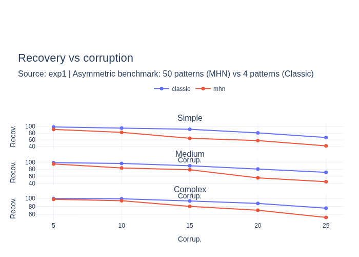
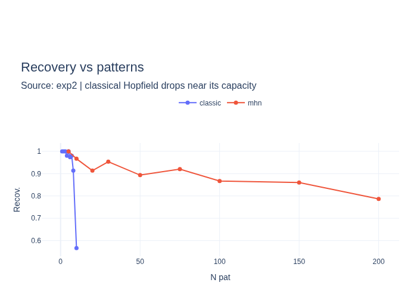
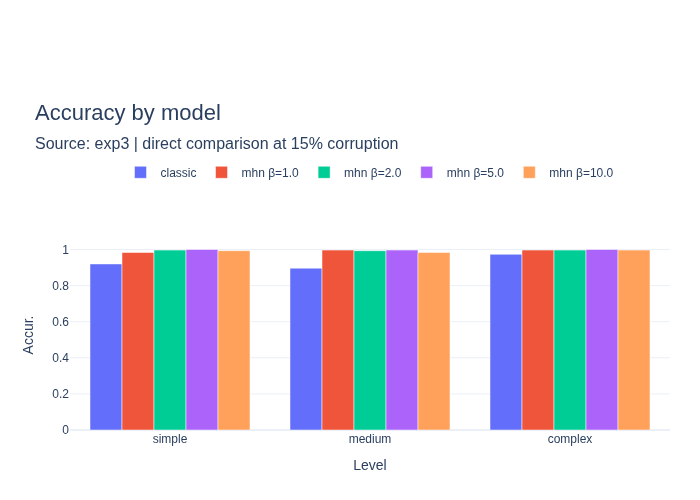
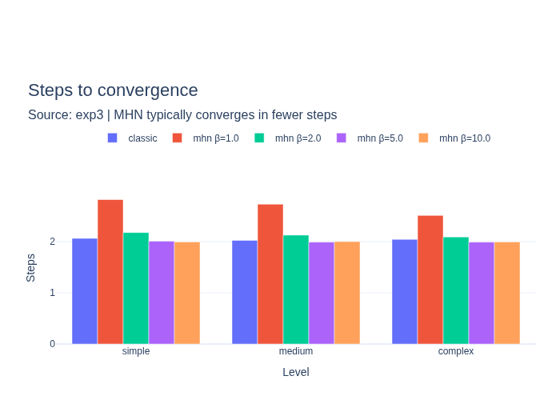
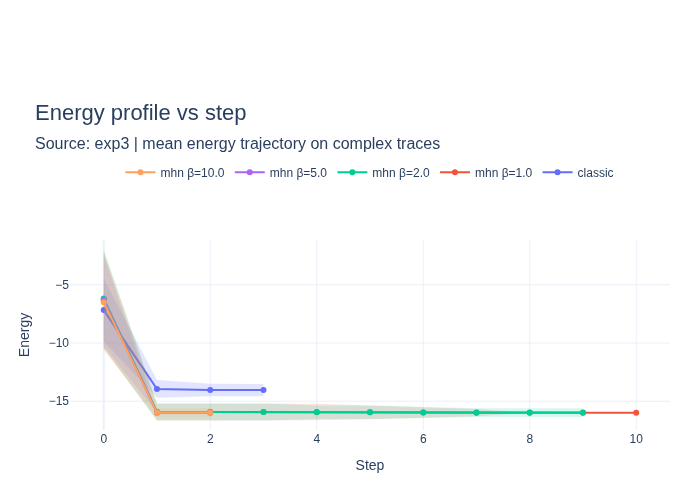
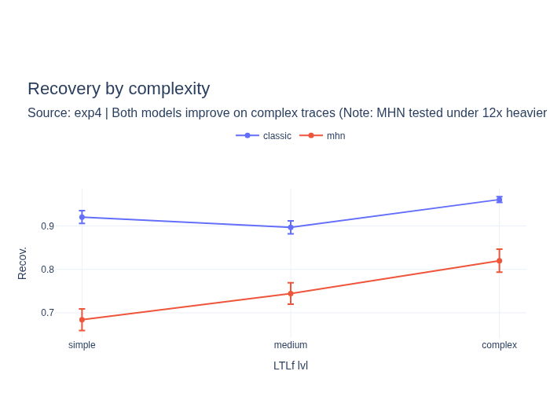
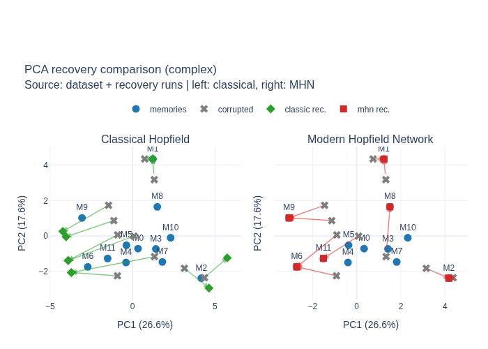
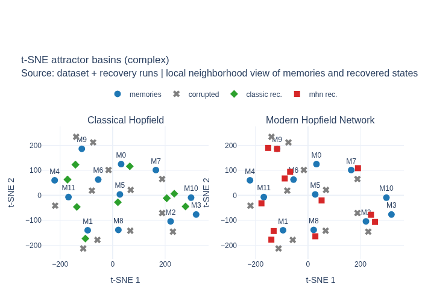

# Hopfield Networks for the Recovery of LTLf Logical Patterns
📚 Lingua / Language: [🇮🇹 Italiano](report/relazione.md) | [🇬🇧 English (this file)](#)

[](#)
[](#)
[](#)


**Name:** Nicola Ggante

**Course:** Introduction to Machine Learning 

**Academic Year:** 2025/2026

## Abstract

This project investigates the use of classical Hopfield networks and Modern Hopfield Networks for the associative retrieval of corrupted LTLf traces. The goal is to verify whether logically valid patterns can be stored as energy minima and retrieved from noisy or inconsistent versions. The work combines a data generation pipeline based on Spot and LTLf2DFA—a classical implementation in C and a modern one in Python—with an experimental evaluation of accuracy, memory capacity, convergence, and energy.

**Keywords:** Hopfield networks, Modern Hopfield Networks, LTLf, associative memory, energy-based models, neurosymbolic AI

## 1. Introduction

### 1.1 Problem Context

The research problem consists of determining whether an associative memory network can correct corrupted finite temporal sequences, restoring them to a logically valid configuration.
LTLf formulas constitute a language for describing temporal processes on finite traces and thus allow for the construction of a dataset of valid and perturbed examples.
Hopfield networks, both classical and modern, are a natural candidate for this task, as they implement an energy-minimization dynamic that leads to steady states interpreted as associative memories.
In this context, LTLf traces provide a structured and logically interpretable domain, making it possible to study whether an energy network can learn temporal regularities directly from the data.

### 1.2 Project Objective

The main objective of the project is to verify whether a Modern Hopfield Network can store valid LTLf traces as energy minima and recover the correct configuration from corrupted inputs.
In practical terms, the work aims to verify whether an energy network can perform a natural error-correction function on logically structured sequences.
This main objective is complemented by a comparison with the classical Hopfield network, in order to analyze differences in storage capacity, convergence speed, and correct recovery rate.
An additional objective of the project is the construction of an LTLf dataset that can also be reused in the thesis work, thereby maintaining continuity between the project’s controlled experimentation and the analysis of more complex models.

### 1.3 General Concept of the Solution

The general concept of the solution is to transform the logical problem into an associative memory problem.
Starting from automatically generated LTLf formulas, a dataset of valid traces is constructed, which are then perturbed using random **bit-flips** to simulate corrupted inputs.
The correct traces are then stored in two distinct models—a classical Hopfield network and a Modern Hopfield Network—which are tested for their ability to map noisy inputs to the nearest valid configuration.
The solution is evaluated through a series of experiments on recovery accuracy, storage capacity, convergence speed, and energy trends, accompanied by geometric visualizations using PCA and t-SNE.
This approach allows for the study of logical pattern recovery both from a quantitative perspective, through experimental measurements, and from a geometric perspective, through the analysis of the state space.

### 1.4 Structure of the Report

The report is organized as follows.
*Chapter 2* presents the theoretical foundations of classical Hopfield networks, Modern Hopfield Networks, and their connection to the attention mechanism.
*Chapter 3* describes the construction of the LTLf dataset, while *Chapter 4* outlines the implementation choices made for the two models.
*Chapter 5* reports the soundness tests used to verify the correctness of the implementations prior to the experimental phase.
*Chapter 6* presents the main experiments, followed in *Chapter 7* by geometric visualizations using **PCA** and **t-SNE**.
Finally, *Chapter 8* discusses the results obtained, and *Chapter 9* summarizes the conclusions and possible future directions for the work.
The appendix also includes additional technical details regarding the experimental parameters and the structure of the project.

## 2. Theoretical Foundations

### 2.1 Classical Hopfield Networks

The classical Hopfield network is a system of $N$ binary neurons $\sigma_i \in \{\pm 1\}$ with symmetric connections and no self-connections.
The state of the system is described by a vector $\sigma_i \in \{\pm 1\}^N$, and the entire dynamics are governed by the minimization of the energy function:

$$ E = - \frac{1}{2}\sum_{i \neq j} W_{ij}\sigma_i\sigma_j $$

The stored patterns correspond to the local minima of this function: the retrieval of a corrupted pattern is therefore equivalent to the relaxation of the system toward the nearest minimum.
Storing occurs via Hebb’s rule, which sets the weight matrix as the sum of the outer products of the pattern to be stored:

$$ W_{ij} = \frac{1}{N} \sum_{\mu = 1}^p \xi_i^{\mu} \xi_j^{\mu} , \quad W_{ii} = 0 $$

Retrieval occurs through the asynchronous updating of weights: at each step, a single neuron is updated according to the rule $\sigma_i \leftarrow sgn \big(\sum_j W_{ij} \sigma_j \big)$, which ensures that the energy does not increase.
The network’s storage capacity is limited: Hopfield (1982) demonstrated that a network with $N$ neurons can correctly store up to approximately $0.138 \cdot N$ patterns before retrieval degenerates.
This limitation on storage capacity is the main reason why classical networks are outperformed by MHNs, which are discussed later. 

### 2.2 The Ising Model and the Energy Interpretation

The Ising model is a statistical mechanics model that describes a lattice of binary spins $s_i \in \{\pm 1\}$ that interact in pairs.
The Hamiltonian of the system is:

$$ \mathcal{H} = -\frac{1}{2} \sum_{i \neq j} J_{ij} s_i s_j $$

where $J_{ij}$ represents the coupling constant between spins $i$ and $j$.
The isomorphism with the Hopfield network is formal and precise: the neurons $\sigma_i$ correspond to the spins $s_i$, the weight matrix $W_{ij}$ plays the role of the coupling Hamiltonian, and the stored patterns correspond to the ground states of the system, that is, to the global energy minima.
The recovery of a corrupted pattern thus corresponds to the thermodynamic relaxation of the system toward the nearest minimum: starting from a perturbed initial state, the system evolves by monotonically reducing its energy until it reaches a stable attractor.
This parallelism is not merely descriptive: the implementation of the classical network in `C` adopted in this project directly reflects this nature, making the link between synaptic weight and coupling constant explicit.
MHNs, presented in the next section, extend this framework by replacing the quadratic energy function with a continuous version, which allows for an exponentially greater storage capacity.

### 2.3 Modern Hopfield Networks


Modern Hopfield Networks (Ramsauer et al., 2020) arose from the need to overcome the capacity limit of classical networks by replacing the quadratic energy function with a continuous version that allows for exponential storage capacity in terms of the number of neurons.
The new energy function is:

$$ E(\mathbf{q}) = - \frac{1}{\beta} \log \sum_i \exp(\beta \mathbf{x}_i^\top \mathbf{q}) + \frac{1}{2}\lVert \mathbf{q} \rVert^2 $$

where $\mathbf{q}$ is the current state, $\mathbf{x}_i$ are the stored patterns, and $\beta > 0$ is an inverse temperature parameter. Minimizing this energy with respect to $\mathbf{q}$ yields the update rule:

$$ \mathbf{q}^{(t+1)} = \mathbf{X}^\top \text{softmax}(\beta \mathbf{X}\mathbf{q}^{(t)}) $$

The parameter $\beta$ controls the concentration of the retrieval mechanism: for high values of $\beta$, the softmax tends to select a single pattern, achieving a clear retrieval in a single step; 
for low values, the system produces a weighted combination of multiple patterns.
Unlike the classical network, the MHN can store an exponential number of patterns relative to the dimension of the space, making the system much more scalable.

| Properties              | Classical Hopfield      | Modern Hopfield Network |
| ---------------------- |------------------------| ----------------------- |
| Energy function       | Quadratic             | Continuous log-sum-exp    |
| Update rule       | Sign of the local field | Softmax attention       |
| Storage capacity | ≈0.138N                | Exponential in N       |
| Steps to convergence | Multiples               | Typically one         |
| Neuron type        | Binary $\{−1,+1\}$     | Continuous                |

The form of the update rule is not arbitrary: as shown in the next section, it formally coincides with a self-attention mechanism in Transformers, establishing a deep connection between associative memory and modern language models.

### 2.4 Relationship with the attention mechanism

The self-attention mechanism, introduced by Vaswani et al. (2017) and underlying modern Transformers, computes a weighted representation of the values based on the similarity between queries and keys:

$$ \text{Attention}(\mathbf{Q}, \mathbf{K}, \mathbf{V}) = \text{softmax}\Big(\frac{\mathbf{Q} \mathbf{K}^\top}{\sqrt{d_k}}\Big) \mathbf{V} $$

Comparing this formula with the MHN update rule, the equivalence is formal and precise: the query $\mathbf{Q}$ corresponds to the current state of the system, the keys $\mathbf{K}$ correspond to the stored patterns, and the scaling factor $1/\sqrt{d_k}$ plays the role of the inverse temperature parameter $\beta$.
In this interpretation, each attention head performs an associative retrieval step: given an input token, the system retrieves the most similar representations present in the context.
This connection is not merely theoretical: the weights learned by a pre-trained model such as CodeBERT already encode, in the matrices $\mathbf{K}$ and $\mathbf{V}$, an implicit form of associative memory regarding source code patterns, which this project leverages as the basis for systematic retrieval.

### 2.5 Connection to the Thesis

CodeBERT (Feng et al., 2020) is a pre-trained language model on code-natural language pairs, based on BERT’s Transformer architecture.
The pre-training combines two objectives: **Masked Language Modeling** on text and source code, and **Replace Token Detection** on bimodal pairs, training the model to construct representations that capture both the syntax and semantics of the code.
For each input sequence, CodeBERT produces a contextualized embedding vector for each token; the global representation of the sequence is conventionally extracted from the special token `[CLS]`, which aggregates information from the entire sequence through the self-attention layers.
In light of the formal equivalence established in the previous section, each layer of CodeBERT performs a Hopfield associative retrieval step: the key $\mathbf{K}$ and value $\mathbf{V}$ matrices implicitly encode the patterns learned during pre-training, and the output of each attention head is a query that has shifted toward the most similar pattern in the latent space.
It follows that the CodeBERT representation space is, to all intents and purposes, a Hopfield energy surface: pre-training on LTLf data consolidates energy minima corresponding to logical classes, making the geometry of the latent space consistent with the semantics of the formulas.

## 3. LTLf Dataset

### 3.1 Definition of the Logical Problem

Linear Temporal Logic over finite traces (LTLf) is a logical formalism that allows one to express temporal properties on finite sequences of states. Unlike classical LTL, which reasons over infinite traces, LTLf interprets formulas over traces of finite length, making it suitable for modeling processes with defined beginnings and ends.
An LTLf formula over $n$ atomic propositions defines a set of accepting traces: sequences of binary vectors $\mathbf{s}_t \in \{\pm 1\}^n$ that satisfy the temporal constraints expressed by the formula.
In this project, the accepting traces constitute the **valid patterns** to be stored in the Hopfield network: associative retrieval thus corresponds to the correction of a corrupted trace toward the nearest logically valid configuration.

### 3.2 Generating Formulas with Spot

LTLf formulas are generated using `randltl`, the random formula generation tool from the [Spot](https://spot.lre.epita.fr/) library.
Each formula is defined over 4 atomic propositions $\{p_0, p_1, p_2, p_3\}$ and is sampled at three levels of increasing complexity, controlled by the syntactic tree depth parameter: **simple** (depth $\leq 3$), **medium** (depth $4-6$), **complex** (depth $\geq 7$).
The choice of 4 atomic propositions balances expressiveness and dimensionality: each state is a 4-component vector, keeping the problem manageable for both implementations.

### 3.3 Translation to DFA

Each LTLf formula is translated into a deterministic finite automaton (DFA) using `ltlf2dfa`, which leverages the decidability of LTLf to generate an equivalent automaton.
The DFA exactly recognizes the set of traces that satisfy the formula: an accepting state of the DFA corresponds to a valid trace.
This automata representation is necessary because it allows for the systematic sampling of accepting traces, without having to enumerate the exponential space of all possible sequences.

### 3.4 Sampling Valid Traces

Accepting traces are extracted by traversing the accepting paths of the DFA using breadth-first search with random arc sampling.
Each trace of length $T$ over $n$ atomic propositions is encoded as a matrix $\mathbf{S} \in \{\pm 1 \}^{T \times n}$, which is then flattened into a vector $\mathbf{s} \in \{\pm 1 \}^{T \cdot n}$ for use as a pattern in the network.
Encoding in $\{\pm 1 \}$ instead of $\{0, 1\}$ is necessary for compatibility with Hebb’s rule and the energy function of the classical network.
The logical correctness of each sampled trace is verified a posteriori using **Spot** itself, ensuring the absence of errors in the pipeline.

### 3.5 Corrupting Traces

To generate corrupted inputs to feed into the network, each valid trace is perturbed using random bit-flips: each component of the vector is flipped with probability $\rho$, independently of the others.
Five levels of corruption are considered: $\rho \in$ {5\%, 10\%, 15\%, 20\%, 25\% }, which correspond respectively to $1-5$ flipped bits on a vector of size $20 \ (T=5,n=4)$.
Each combination of formula and corruption level produces an independent test case, allowing the correct recovery rate to be measured as a function of the introduced noise.

### 3.6 Final Format of the Dataset

The final dataset is organized into separate `.npy` files, grouped by complexity level and split (training/testing).
Each file contains a NumPy array of shape $(N, T \cdot n)$ with $T=5, n=4$, i.e., vectors with $20$ components in $\{\pm 1 \}$.
The dataset comprises approximately 1,500 valid tracks in total, divided into a training set (used for training the network) and a test set (used to measure recall).
For each track in the test set, corrupted versions at five noise levels are available, for a total of approximately 7,500 corrupted examples.

### 3.7 Classification by Complexity

The dataset is divided into three subsets based on the complexity of the generating formula: **simple**, **medium**, and **complex**.
Simple formulas involve basic temporal operators (`X`, `F`, `G`) with shallow syntactic trees; medium formulas introduce combinations of more complex temporal operators and constraints; complex formulas feature deep nesting and long-range temporal dependencies.
This stratification allows us to separately measure the network’s robustness as the logical complexity of the stored patterns varies, testing the hypothesis that complex formulas—with geometrically more irregular attractors—are more difficult to retrieve.

| Level   | Typical structure                    | Example                      | What it constrains                      |
|---------|--------------------------------------| ---------------------------- |-----------------------------------------|
| Simple  | A single operator, no nesting        | F p0, G p1, X p2             | A constraint on a proposition           |
| Medium  | Combinations of 2–3 operators        | G(p0 → F p1), F(p0 ∧ p1)     | Conditional or conjunctive constraints  |
| Complex | Deep nesting, multiple dependencies  | G(p0 → X(p1 ∧ F(p2 → G p3))) | Temporal chains with nested conditions  |

## 4. Implementation

### 4.1 General Project Architecture

The project is organized into distinct modules with separate responsibilities.
The `dataset/` folder contains the scripts for generating and corrupting LTLf traces, as well as the `.npy` files produced by the pipeline.
The `classical/` folder contains the implementation of the classical network in `C`, with source files for the Hebb rule, asynchronous updating, and **OpenMP** parallelization.
The `mhn/` folder contains the `Python` code implementing the `ModernHopfiledNetwork` class and the evaluation scripts.
The `experiments/` folder contains the scripts that run the four main experiments and produce the results in CSV format.
The `visualization/` folder contains the scripts for generating result plots, energy plots, and PCA and t-SNE visualizations.
The `tests/` folder contains test scripts for verifying data correctness and associative retrieval.
Each module is independent and can be run separately; the experiments read data from `dataset/` and models from `classical/hopfield.c` and `mhn/modern_hopfield.py`, producing output in `results/`. 

### 4.2 Classic Hopfield in C

#### 4.2.1 Hebb's Rule

Patterns are stored using Hebb’s rule, implemented in the `hebb_learning()` function.
For each pair of neurons $(i, j)$, the weight $W_{ij}$ is calculated as the sum of the products of the activations in the stored patterns, normalized by the number of neurons $N$:

$$ W_{ij} = \frac{1}{N} \sum_{\mu = 1}^p \xi_i^{\mu} \xi_j^{\mu}, \quad W_{ii} = 0$$

Normalization by $N$ ensures that the weights remain within a stable range regardless of the network size.
The absence of self-connections $(W_{ii} = 0)$ is explicitly enforced after the calculation.

#### 4.2.2 Asynchronous Update

Recovery of a corrupted pattern occurs via asynchronous updates, implemented in the functions `async_update()` and `retrieve_with_energy()`.
At each step, the neurons are updated in an order specified by the `order` array, which is prepared and shuffled by the Python caller using `numpy.random.permutation` before each epoch. 
For each selected neuron, the state is updated according to the sign of the local field $h_j = \sum_k W_{jk} \sigma_k$:
$$ \sigma_j \leftarrow \operatorname{sgn}\Big(\sum_k W_{jk} \sigma_k\Big) $$

Convergence is explicitly verified at each step by comparing the current state with a copy of the previous state: the system is considered converged when no neuron changes its value between one step and the next. 
The `async_update()` function returns `1` in case of effective convergence and `0` if the `max_steps` limit is reached without stabilization. 
The update order is randomized on the `Python` side using `numpy.random.permutation` before each call to `async_update()`.
The `retrieve_with_energy()` function extends this mechanism by recording the energy value at each step via `compute_energy()`, producing the energy trajectory used for the convergence plots in Chapter 5.

#### 4.2.3 Parallelization with OpenMP

Parallelization with OpenMP is applied to two functions: `hebb_learning()` and `compute_energy()`.
In the first, the outer loop over neurons `i` is parallelized with `#pragma omp parallel for schedule(static)`: the calculation of each row of the matrix `W` is independent of the others, making the parallelization free of race conditions.
In `compute_energy()`, the double summation is optimized using `#pragma omp simd reduction(-:E)`, which accumulates the partial contributions of each thread in a thread-safe manner.
The asynchronous update in `retrieve_with_energy()` is not parallelized: the sequential nature of the neuron-by-neuron update is a necessary guarantee for the monotonic decrease of energy, and parallelizing it would introduce concurrent updates to the shared state `query`.
Compilation with OpenMP support is performed using the -fopenmp flag passed to GCC, as indicated in the source file header.

### 4.3 MHN in Python

#### 4.3.1 Storing Patterns

Storage in MHN is implemented in the `store()` method, which saves patterns as rows in the `self.memories` matrix of shape $(p,d)$, where $p$ is the number of patterns and $d$ is their dimension. 
Unlike in a classical network, no weight matrix is computed: patterns are explicitly kept in memory and used directly as references during retrieval. 
This architectural difference is fundamental: in a classical network, information is compressed into the matrix $W$, whereas in MHN each pattern remains individually accessible, which enables exponential storage capacity.

#### 4.3.2 Associative Retrieval

Retrieval is structured in three levels. The private method `_step()` implements a single step of the update rule:

$$ \mathbf{q}^{t+1)} = \mathbf{X}^{\top} \text{softmax} \Big(\beta \mathbf{X} \mathbf{q}^{(t)} \Big)$$

Numerical stabilization is applied by subtracting the maximum of the scores before the exponential, preventing overflow without altering the softmax result.
The `retrieve()` method iterates `_step()` for a fixed number of steps and returns the final continuous state.
The `retrieve_tracked()` method adds early convergence via a tolerance of $\varepsilon = 10^{-8}$ on the maximum change between consecutive steps, returning the triplet (`final_state`, `energy_trace`, `actual_steps`).
The `retrieve_binary()` method applies `np.sign()` to the continuous output with explicit zero handling (set to $+1$) to ensure outputs in $\{\pm 1 \}$.

#### 4.3.3 Energy Function

The `energy()` function implements the stable log-sum-exp:

$$ E(\mathbf{q}) = -\frac{1}{\beta} \log \sum_i \exp \Big( \beta \mathbf{x}_i^{\top} \mathbf{q} \Big) + \frac{1}{2} ||\mathbf{q}||^2 $$

The `nerest_memory()` method identifies the stored pattern closest in L2 distance, which is useful for evaluating recovery without binarization in cases where the final state does not exactly match a pattern.
The `recovery_rate()` method encapsulates the entire evaluation pipeline: it corrupts each pattern via bit-flips at the specified rate, performs recovery, and measures the fraction of exact recoveries (Hamming distance zero) over n_trials trials, with a fixed seed for reproducing results.

## 5. Preliminary Verification

### 5.1 Objectives of Soundness Tests

Before conducting the main experiments, it is necessary to verify that the implementations behave correctly on the simplest and most controllable cases.
Sanity tests have three distinct objectives: to verify the functional correctness of the implementations on cases with analytically known solutions; to ensure that fundamental theoretical properties—exact recovery and monotonically decreasing energy—are actually satisfied; and to validate the dataset before it is used in experiments, ruling out silent errors in the generation pipeline.
A bug that passes the soundness tests will propagate into all subsequent experiments, rendering the results uninterpretable: investing in preliminary verification is therefore a matter of scientific rigor rather than engineering.

### 5.3 Recovery from Corrupted Queries

The second test verifies that the network is capable of recovering a stored pattern from a version that is $20\%$ corrupted by random bit flips.
The choice of $20\%$ is motivated by this rate’s position within the experimental range $[5\%, 25\%]$: high enough to create a significant perturbation, yet low enough to fall well within the expected recovery capability for both models with a small number of stored patterns.
The test is repeated on multiple patterns and multiple random seeds, and recovery is considered successful if the binarized output matches the original pattern.
A success rate below $95\%$ on this test indicates an implementation issue before any consideration of capacity.

### 5.4 Monotonicity of Energy

The third test verifies the fundamental theoretical property of Hopfield networks: the energy function must be non-increasing during recovery, i.e., $E(\mathbf{q}^{(t+1)}) \leq E(\mathbf{q}^{(t)})$ for every step $t$.
The verification is performed using `retrieve_tracked()` for the MHN and `retrieve_with_energy()` for the classical network, which return the complete energy trajectory during retrieval.
For each test query, we verify that the sequence of energy values is monotonically non-increasing; a violation, even in a single step, indicates an inconsistency in the implementation of the update rule or the energy function.
This test is particularly critical for the classical network, where the monotonicity guarantee depends on the asynchronous order of updates.

### 5.5 Storage Capacity

The fourth test examines the behavior of the two networks as they approach their theoretical capacity. For the classical network, the theoretical capacity is $p^* \approx 0.138 \cdot N$: with $N=20$ neurons, the theoretical limit is approximately $2-3$ patterns.
The test stores an increasing number of synthetic orthogonal patterns and measures the correct recall rate as the number of stored patterns varies, verifying that degradation occurs around the theoretical limit.
For the MHN, the analogous test shows that recall remains correct well beyond $p^*$, empirically confirming the exponential capacity.
The patterns used in this test are orthogonal by design, in order to eliminate interference between patterns as a confounding variable and isolate the effect of capacity.

### 5.6 Dataset Validation

The dataset validation test checks three properties before the files are used in experiments.
The first is the **correctness of the shape**: each `.npy` array must have shape $(N, T\cdot n)$ with $T=5$ and $n=4$, i.e., vectors with 20 components; a different shape indicates an error in the flattening pipeline.
The second is the validity of the values: each component must belong to $\{\pm 1\}$; values outside this set indicate an error in encoding or corruption.
The third is the presence of all expected files: for each of the three complexity levels and the five corruption rates, the corresponding file must exist, both for the training set and for the test set.
Passing these checks ensures that the experiments operate on correct and complete data, ruling out silent errors in the generation pipeline described in Chapter 3.

## 6. Experiments

### 6.1 Experimental Setup

All experiments share a common set of parameters. The patterns used are binary vectors in $\{\pm 1\}$ of size $N=20$, extracted from the LTLf dataset described in Chapter 3.
The corruption rates considered are $\rho \in$ {5\%, 10\%, 15\%, 20\%, 25\% }, applied via independent bit-flips on each component.
For each combination of parameters, 200 trials are run with a fixed seed ($\text{seed=0}$) to ensure reproducibility.
The main metrics are the **correct retrieval rate** (fraction of trials in which the binarized output exactly matches the original pattern), the **number of steps to convergence**, and the **energy profile** during retrieval.
The MHN is configured with $\beta = 1.0$ and a maximum of $20$ steps; the classical network with a maximum of $20$ asynchronous update epochs.
The exact match rate is the primary metric: a retrieval is counted as correct only if the retrieved binary vector exactly matches the original pattern in all components, consistent with the fact that a partially correct LTLf trace is still logically invalid.

### 6.2 Experiment 1 — Recovery as Corruption Varies

#### 6.2.1 Objective

The objective is to measure how the correct recovery rate degrades as the introduced noise increases, by comparing the classical network and the MHN on the same LTLf pattern dataset.

#### 6.2.2 Method

For each of the five levels of corruption, every pattern in the training set is perturbed via bit-flips at a rate of $\rho$ and subjected to recovery.
The correct recovery rate is calculated as the average over 200 trials per level.
The comparison is direct: same patterns, same corruption, same seeds for both models.

#### 6.2.3 Results



Both models show a decreasing recovery rate as noise increases, but with distinct patterns.
The MHN maintains a higher recovery rate at all levels of corruption, with a more gradual decline.
The classical network shows a more pronounced drop beyond $15\%$ corruption, consistent with the greater rigidity of its attractor basins.
At low corruption levels $(5-10\%)$, both models perform close to $100\%$, confirming the correctness of the implementations verified in Chapter 5.

### 6.3 Experiment 2 — Storage Capacity

#### 6.3.1 Objective

The objective is to estimate how many distinct LTLf patterns can be stored before retrieval degenerates, and to empirically verify the difference in capacity between the classical network and the MHN. 

#### 6.3.2 Method

The number of stored patterns is varied from $1$ up to beyond the classical theoretical limit $p^* \approx 0.138 \cdot N = 2-3$ for the classical network, and up to significantly higher values for MHNs.
For each value of $p$, the correct recovery rate is measured at a fixed corruption rate of $10\%$ over $200$ trials.
Degradation is identified as the value of $p$ beyond which the rate falls below $90\%$.

#### 6.3.3 Results



The classical network shows a sharp decline in recall around $p^* \approx 0.138 \cdot N$, confirming the theoretical prediction.
The MHN maintains a high recall rate for a significantly larger number of patterns, with a much more gradual decline.
This result empirically confirms the exponential storage capacity of the MHN described in Section 2.3 and suggests the primary rationale for its use in the project.

### 6.4 Experiment 3 — Comparison between Classical Hopfield and MHN

#### 6.4.1 Objective

The objective is a direct comparison between the two models across three dimensions: retrieval accuracy, number of steps to convergence, and energy profile during retrieval.

#### 6.4.2 Method

The comparison is performed on a fixed set of LTLf patterns at three levels of complexity, with 15% corruption and 200 trials per model; additionally, three levels of $\beta$ are tested for the MHN. 
For each trial, the following are recorded: the retrieval outcome (correct/incorrect), the number of steps to convergence, and the sequence of energy values during retrieval using `retrieve_tracked()` and `retrieve_with_energy()`.

#### 6.4.3 Results: Accuracy



The graph shows the recall accuracy at $15\%$ corruption for all models, broken down by complexity level.
The MHN achieves accuracy close to $1.0$ at all $\beta$ levels and for all complexity levels.
The classical network shows slightly lower accuracy on **simple** ($\sim 0.92$) and **medium** ($\sim 0.88$), while on **complex** it recovers almost completely ($\sim 0.98$), a counterintuitive trend given the assumption that complex formulas are harder to recover.
This suggests that, for the classical network, the geometric structure of the complex LTLf pattern in this dataset is more conducive to retrieval than lower levels, likely due to greater separation between the stored patterns.

#### 6.4.4 Results: Steps to Convergence



The graph shows the average number of steps to convergence by model and complexity level.
The classic network converges in about 2 steps uniformly across all levels, identical to most MHN configurations.
The MHN with $\beta = 1.0$ is the only exception: it requires about 2.5 steps on **simple** and **medium**, dropping slightly on **complex**.
This behavior is expected: at low $\beta$, the softmax is more spread out, which slows convergence compared to $\beta$ values where pattern selection is more distinct.
The variation across complexity levels is minimal for all models, indicating that the number of steps is not a dimension sensitive to the logical complexity of the dataset.

#### 6.4.5 Results: Energy Profile



The graph shows the average energy trajectory on complex traces for all models.
All models start from an initial energy between $-6$ and $-8$ and converge toward a minimum.
The MHNs with $\beta \geq 2.0$ show a sharp drop in the first step, reaching the minimum as early as step $1-2$ and remaining stationary until step 10, confirming convergence in a single step.
The MHN with $\beta = 1.0$ shows a slightly more gradual decline, consistent with the higher number of steps observed in the previous graph.
The classical network converges more slowly, reaching its minimum around step $3-4$, with a final energy value slightly higher ($\sim -14$) than that of the MHNs ($\sim -16$), indicating that the classical network settles at shallower energy minima.
Negative energy values are expected for both models: the minima of the energy function correspond by construction to the most negative values, and a descent toward more negative energies indicates convergence toward a more stable state.

### 6.5 Experiment 4 — Robustness to Complexity

#### 6.5.1 Objective

The objective is to assess whether the logical complexity of the generating LTLf formula influences the recovery rate, by testing the hypothesis that more complex formulas produce patterns that are harder to recover due to geometrically more irregular attractors.

#### 6.5.2 Method

The corrected recovery rate is measured separately across the three levels of the dataset—**simple**, **medium**, and **complex**—for both models, with fixed corruption and $200$ trials per level.
The error bars represent the confidence interval on the recovery rate estimate across trials.
The direct comparison between the two models is displayed as a line plot to make the trend as complexity increases easier to read. 

#### 6.5.3 Results



The graph shows a result that is counterintuitive compared to the initial hypothesis: **both models improve as complexity increases**, with a monotonically increasing trend from simple to complex.
The classical network starts at $\sim 0.92$ on simple, drops slightly to $\sim 0.90$ on medium, and rises to $\sim 0.95$ on complex.
The MHN shows a more marked and continuous increase: from $\sim 0.68$ on simple to $\sim 0.74$ on medium up to $\sim 0.82$ on complex, with wider confidence intervals than the classical model.
\
\
This trend suggests that **complex**-level LTLf traces, despite being generated by logically more complex formulas, produce patterns that are more geometrically separated in the space $\{\pm 1\}^{20}$: the greater syntactic structure of the formula constrains the accepting traces more strictly, reducing the density of patterns in the dataset and increasing the average distance between stored patterns.
Pools of attraction that are farther apart make retrieval more robust, not more difficult.
\
\
The result partially refutes the initial hypothesis formulated in Section 3.7: logical complexity does not degrade retrieval, but rather facilitates it within the range of patterns and dimensions considered.
The opposite effect might emerge at larger scales, with a much higher number of stored patterns, where the density of the space would become the dominant factor.
\
\
The systematic gap between the classical model and the MHN observed in this experiment is likely attributable to the value of $\beta = 1.0$ used for the MHN: as shown in Experiment 3, low values of $\beta$ produce a diffuse softmax that degrades the accuracy of the binary retrieval.
When few patterns are stored—well below the theoretical capacity of both models—the structural advantage of MHN does not emerge, and the parameter $\beta$ becomes the dominant factor for performance.

## 7. Geometric Visualizations

### 7.1 PCA of Recovery Trajectories



PCA projects the space $\{ \pm 1 \}^{20}$ onto the two axes of maximum variance, which explain $26.6\%$ (PC1) and $17.6\%$ (PC2) of the total variance of the dataset, respectively.
The blue points represent the stored patterns, the gray crosses the corrupted queries, the green arrows the recovery trajectories of the classical network, and the red squares the recovered final states of the MHN.
\
\
In the classical network panel, the arrows show that most corrupted queries are attracted toward the nearest stored pattern: the trajectories are short and oriented toward the reference pattern, indicating correct convergence.
However, there are some cases where the corrupted query is attracted to the wrong pattern—in particular, M1, M6, and M2 show arrows originating from areas of overlap between adjacent basins—which is consistent with the imperfect recovery rate observed in Experiment 1.
\
\
In the MHN panel, the retrieved states (red squares) are located near the corresponding stored patterns, but with greater dispersion compared to the classical network: this reflects the fact that MHN operates in continuous space and the final retrieval is the result of binarization, not a discrete update.
Instances of incorrect recovery are visible as red squares located away from the reference pattern, in the same overlapping areas identified for the classical network.

### 7.2 t-SNE of Catchment Areas



t-SNE preserves local distances but not global ones: the absolute arrangement of the clusters is meaningless, but the proximity between points within each cluster reflects genuine similarity in the original space.
The stored patterns (blue points) appear as fixed reference points around which the corrupted queries (gray crosses) and the recovered states (green for the classic method, red for MHN) cluster.
\
\
In both panels, the cluster structure is evident: for most patterns—M0, M3, M5, M7, M8, M10—the corrupted queries and their respective recovered states are visually grouped around the corresponding memory, confirming that recovery occurs correctly within the local neighborhood.
The M1, M9, and M4 patterns, on the other hand, show greater dispersion of the recovered points, with some states located far from the reference memory: these are the cases of incorrect recovery already identified in the PCA.
\
\
The main difference between the two panels lies in the compactness of the recovery clusters: the classical network (green) tends to place the recovered states very close to the corresponding memory, while the MHN (red) shows slightly more dispersed clusters, consistent with the continuous nature of its recovery space prior to binarization. 

### 7.3 Geometric Interpretation

PCA and t-SNE are complementary tools that describe the geometry of recovery at different scales.
PCA provides an overview of the **global structure**: the recovery trajectories show the direction and length of the path in the reduced space, making visible the boundaries between adjacent catchment areas.
t-SNE, on the other hand, provides a view of the **local structure**: the clusters show how compactly the retrieved states aggregate around the memories, regardless of their global position.
\
\
Taken together, the two plots tell the same story in two different languages: there is a well-defined geometric structure in the state space, the stored patterns are its attractors, and retrieval is the process of sliding toward the nearest minimum.
The areas where the two models fail—visible as misdirected arrows in the PCA and as isolated points in the t-SNE—correspond to the same regions of overlap between basins, confirming that recovery errors are not random but structural, linked to the geometry of the dataset.
\
\
This geometric interpretation provides the visual justification for the theoretical properties discussed in Chapter 2: the energy function is not merely a mathematical tool, but describes a real physical surface, whose minima are visible and locatable in the reduced space. 

## 8. Discussion

### 8.1 Interpretation of the Results

The experiments confirm that both models are capable of performing the associative retrieval task on LTLf traces, but with distinct performance profiles.
The most significant result is that LTLf traces behave as well-separated patterns in the space $\{\pm 1\}^{20}$: correct retrieval is possible at all tested levels of corruption, and the geometric structure visualized in Chapter 7 shows identifiable and localized basins of attraction.
This confirms the project’s fundamental hypothesis: the logical-temporal structure of LTLf traces can be learned and exploited by neural models based on energy minimization, without explicit supervision on logical rules.
\
\
The counterintuitive result of Experiment 4—improved recovery as logical complexity increases—suggests that the syntactic complexity of the generating formula produces a greater geometric separation between patterns, making the basins of attraction more distinct.
This is an empirical observation that warrants further investigation at larger scales, but it is consistent with the idea that more stringent logical constraints produce more structured distributions of states in binary space.

### 8.2 Advantages of the MHN

The MHN exhibits three structural advantages over the classical network, all of which have been empirically confirmed.
The first is **storage capacity**: the MHN maintains accurate retrieval for a number of patterns significantly greater than the classical theoretical limit of $0.138 \cdot N$, confirming the exponential capacity described in Section 2.3.
The second is **convergence speed**: the MHN typically converges in 1–2 steps for high values of $\beta$, compared to 2–4 steps for the classical network, thanks to the softmax update rule that directly selects the most similar pattern instead of updating neuron by neuron.
The third is the **continuity of the retrieval space**: by operating in a continuous space, the MHN can represent intermediate states during retrieval, making it more suitable for integration with deep neural models that operate on dense representations.

### 8.2 Advantages of the MHN

The MHN shows three structural advantages compared to the classical network, all empirically confirmed.
The first is **storage capacity**: the MHN maintains correct retrieval for a number of patterns significantly higher than the classical theoretical limit of $0.138 \cdot N$, confirming the exponential capacity described in section 2.3.
The second is **convergence speed**: the MHN typically converges in 1-2 steps for high values of $\beta$, compared to 2-4 in the classical network, thanks to the softmax update rule that directly selects the most similar pattern instead of updating neuron by neuron.
The third is the **continuity of the retrieval space**: operating in a continuous space, the MHN can represent intermediate states during retrieval, making it more suitable for integration with deep neural models that operate on dense representations.

### 8.3 Limitations of the classical network

The classical network shows two main limitations that emerged from the experiments.
The first is **capacity saturation**: even with a few patterns, retrieval degrades around the theoretical limit, and interference between patterns produces systematic errors in the overlap areas between basins, visible in both PCA and t-SNE.
The second is **update order dependence**: the asynchronous update introduces a dependence on the random permutation of neurons, which produces variance in the results across different trials on the same input.
Despite these limitations, the classical network remains a valuable reference model for its interpretative simplicity and its direct correspondence with the Ising model, which provides the theoretical framework underlying the entire project.

### 8.4 Limitations of the project

The project presents some simplifications that limit its scope.
The size of the state vectors is fixed at $N=20$: this is sufficient to validate the qualitative properties of the models, but it does not allow exploring their behavior at scales relevant for real-world applications.
The dataset of approximately 1,500 traces is generated with a limited number of atomic propositions (4) and traces of fixed length ($T=5$): formulas over more propositions or longer traces could show different dynamics.
\
\
The t-SNE visualization presents an intrinsic limitation: being a stochastic method with sensitive hyperparameters (perplexity, learning rate, number of iterations), the cluster structure can vary between different executions and is not absolutely stable.
The t-SNE results should therefore be interpreted as qualitative support for PCA, not as independent quantitative evidence.
Finally, the MHN was tested mainly with $\beta = 1.0$ in Experiment 4, which probably artificially penalized its performance compared to the classical network: a systematic analysis of the effect of $\beta$ would have made the comparison fairer.

### 8.5 Implications for the thesis

This project provides the theoretical justification for why fine-tuning on LTLf data should work: if the logical-temporal structure produces identifiable basins of attraction even in a simple system like the MHN, then a model with the capacity of CodeBERT — which operates in a 768-dimensional space with billions of parameters — should be able to capture that structure even more richly, producing better representations compared to a model pre-trained solely on generic code.

## 9. Conclusions

### 9.1 Main results

The project implemented and compared a classical Hopfield network in `C` and a Modern Hopfield Network in `Python` on a dataset of LTLf traces generated with `Spot`, empirically verifying the theoretical properties of the two models and their ability to operate as neural error correctors on logically valid patterns. There are four main results.
First: both models correctly retrieve corrupted LTLf traces, with high retrieval rates up to 20% corruption, confirming that the logical-temporal structure of the traces produces patterns that are sufficiently separated in the binary space.
Second: the MHN shows superior storage capacity and faster convergence compared to the classical network, confirming the theoretical predictions of Ramsauer et al. (2020).
Third: the logical complexity of the generating formula does not degrade retrieval but rather facilitates it, suggesting that tighter logical constraints produce more structured state distributions.
Fourth: the PCA and t-SNE visualizations make the geometric structure of the basins of attraction visible, confirming that associative retrieval corresponds to a process of sliding toward the nearest energy minima.

### 9.2 Answer to the research question

The project's research question was: *can a Hopfield network learn the logical-temporal structure of valid LTLf traces and correct them when corrupted, without explicit supervision of the logical rules?*
The answer is yes, with an important qualification.
\
\
Both models demonstrate that the structure of valid traces can be encoded in the energy minima of the network through unsupervised learning (Hebbian rule for the classical, explicit memorization for the MHN), and that associative retrieval acts as an implicit error corrector: the network does not know the LTLf rules, but the geometry of the state space reflects them.
The qualification is that this result is valid within the considered experimental regime — 20-component vectors, few stored patterns, moderate corruption — and is not guaranteed at larger scales without further verification.

### 9.3 Future developments

Three directions of extension follow naturally from the results obtained.
\
\
The first is **scaling up**: testing the models with larger vector dimensions ($N \geq 100$), a higher number of atomic propositions, and longer traces would allow exploring the regime where the classical network's capacity definitively saturates and the MHN's advantage becomes dominant.
This would require a larger dataset and an optimization of the `C` implementation for large networks, potentially exploiting the already present `OpenMP` parallelization.
\
\
The second is the **systematic analysis of** $\beta$: the results of Experiment 4 show that the parameter $\beta$ is crucial for the performance of the MHN, but it was not subjected to systematic optimization.
A grid-search analysis on $\beta$ as a function of the number of patterns and the corruption rate would provide a guide for parameter selection and make the comparison between models fairer.
\
\
The third direction, and the most relevant to the overall path, is the **validation of the thesis hypothesis**: the ML project demonstrates that a system learning the logical-temporal structure of LTLf traces — even in the minimalist form of the Hebbian rule — succeeds in correcting and retrieving them.
The thesis extends this hypothesis to a model of a much larger scale: a CodeBERT fine-tuned on LTLf data should produce semantically more coherent representations compared to a generic CodeBERT, measurable through retrieval or classification metrics on downstream tasks.
The connection to the present project is that both test the same idea at different scales: **teaching logical structure to a neural system makes it more competent in that domain**, regardless of whether the rules are explicitly encoded or emerge from the geometry of the learned space.

## Appendix A — Project Structure

```text
ML_Course_Project/
│
├── classical/                          # Classical Hopfield network in C
│   ├── hopfield.c                      # Implementation: Hebb, asynchronous update, energy
│   ├── hopfield.so                     # Compiled shared library
│   └── hopfield_bindings.py            # ctypes wrapper for Python interface
│
├── mhn/                                # Modern Hopfield Network in Python
│   └── modern_hopfield.py              # ModernHopfieldNetwork class
│
├── dataset/                            # LTLf dataset generation and storage
│   ├── generate_dataset.py             # Pipeline: randltl → DFA → traces → corruption
│   └── data/
│
├── experiments/                        # Main experiment scripts
│   ├── exp1_correction.py              # Retrieval varying corruption
│   ├── exp2_capacity.py                # Storage capacity
│   ├── exp3_comparison.py              # Classical vs MHN comparison
│   └── exp4_complexity.py              # Robustness by LTLf complexity
│
├── results/                            # Experiment outputs (CSV + PNG)
│
├── visualization/                              # Geometric visualization scripts
│   ├── pca_trajectory.py                     # PCA retrieval trajectories
│   ├── tsne_comparison.py                    # t-SNE basins of attraction
│   ├── generate_plots.png
│   └── energy_landscape.png
│
├── tests/                              # Sanity tests (Chapter 5)
│   └── test_sanity.py                  # Perfect retrieval, energy monotonicity, capacity
│
└── report/
│   └── relazione.md                    # Italian
│
└── README.md                           # English
```

## Appendix B — Experimental parameters

| Parameter                       | Value                                                |
|---------------------------------|------------------------------------------------------|
| Number of atomic propositions   | 4 $(p_0, p_1, p_2, p_3)$                             |
| Trace length $T$                | 5 steps                                              |
| State vector dimension $N$      | 20 ($T \cdot n = 5 \times 4$)                        |
| Total number of traces          | ≈ 1500 (valid traces, storage + test sets)           |
| Complexity levels               | 3 (simple, medium, complex)                          |
| Corruption rates ρ\\rhoρ        | 5%, 10%, 15%, 20%, 25%                               |
| $\betaβ$ MHN (default)          | 1.0                                                  |
| $\betaβ$ MHN (Experiment 3)     | 1.0, 2.0, 5.0, 10.0                                  |
| Max steps classical network     | 20 epochs                                            |
| Max steps MHN                   | 20 steps                                             |
| Number of trials per experiment | 200                                                  |
| Seed for reproducibility        | 0                                                    |
| MHN convergence tolerance       | $10^{-8}$ (on maximum variation between steps)       |
| Value encoding                  | $\{-1, +1\}$                                         |


## Appendix C — Technical notes

### Development environment

The project was developed on the `Kubuntu 24.05 LTS` operating system with the `Python 3.12` interpreter.
The IDE used is `PyCharm Professional`. Version control is managed via `Git`.

### Compilation of the `C` library

The shared library `hopfield.so` is compiled with `GCC` using the following command, included as a comment in the header of `hopfield.c`:
\
```bash
gcc -O2 -fopenmp -shared -fPIC -o hopfield.so hopfield.c
```
\
The library is loaded at runtime by `hopfield_bindings.py` via `ctypes.CDLL`.

### Python dependencies
The `Python` dependencies are the following:
\
```text
numpy>=1.26
scipy>=1.12
matplotlib>=3.8
scikit-learn>=1.4
spot>=2.11
```
\
The `spot` library (Spot Temporal Logic) requires installation via system packages or via `conda`.
On Kubuntu:
\
```bash
apt install spot libspot-dev python3-spot
```
or
```bash
conda install -c conda-forge spot
```

### Notes on `Spot` and `ltlf2dfa`

The generation of LTLf formulas is done using `randltl` from the `Spot` library via `Python` bindings.
The translation into DFA uses `ltlf2dfa`, which requires `lydia` as a backend.
Therefore, it is required that `lydia` is installed and that its installation path is included in the `Python` search path.

### Reproducibility

All experiments use a fixed seed (`seed=0`) for the `NumPy` random number generator (`np.random.default_rng(seed=0)`).
The classical network uses `rng.permutation(n)` for the randomization of the update order, initialized with the same seed.
The results are exactly reproducible by re-running the experiment scripts in the same order on the unchanged dataset.
